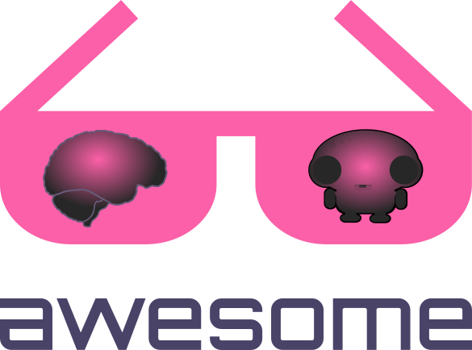

   
    
   

# Awesome NeuroAI Papers  

> A curated list of [Papers](https://github.com/CYHSM/awesome-neuro-ai-papers#papers) & [Reviews](https://github.com/CYHSM/awesome-neuro-ai-papers#reviews) from the intersection of deep learning and neuroscience

This list is providing an overview of recent publications connecting neuroscience & computer science research. As both fields are growing rapidly this list is only presenting a small subset of relevant papers. In case important papers are missing please send a [pull request](https://github.com/CYHSM/awesome-neuro-ai-papers/pulls).

# Papers

Sucevic, J., & Schapiro, A. C. [**A neural network model of hippocampal contributions to category learning**](https://www.biorxiv.org/content/10.1101/2022.01.12.476051v1.full.pdf) bioRxiv (2022)

Conwell, C., Mayo, D., Barbu, A., Buice, M., Alvarez, G., & Katz, B. [**Neural regression, representational similarity, model zoology & neural taskonomy at scale in rodent visual cortex**](https://proceedings.neurips.cc/paper/2021/file/2c29d89cc56cdb191c60db2f0bae796b-Paper.pdf) NeurIPS (2021)

Whittington, J. C., Warren, J., & Behrens, T. E. [**Relating transformers to models and neural representations of the hippocampal formation**](https://arxiv.org/abs/2112.04035) arXiv (2021)

Schrimpf, M., Blank, I. A., Tuckute, G., Kauf, C., Hosseini, E. A., Kanwisher, N., ... & Fedorenko, E. [**The neural architecture of language: Integrative modeling converges on predictive processing**](https://evlab.mit.edu/assets/papers/Schrimpf_et_al_2021_PNAS.pdf) PNAS (2021)

Whittington, J. C., Muller, T. H., Mark, S., Chen, G., Barry, C., Burgess, N., & Behrens, T. E. [**The Tolman-Eichenbaum machine: Unifying space and relational memory through generalization in the hippocampal formation**](https://www.sciencedirect.com/science/article/pii/S009286742031388X) Cell (2020)

Banino, A., Badia, A. P., Köster, R., Chadwick, M. J., Zambaldi, V., Hassabis, D. & Blundell, C. [**Memo: A deep network for flexible combination of episodic memories**](https://arxiv.org/abs/2001.10913) arXiv (2020)

Chengxu Zhuang, Siming Yan, Aran Nayebi, Martin Schrimpf, Michael C. Frank, James J. DiCarlo, Daniel L. K. Yamins [**Unsupervised Neural Network Models of the Ventral Visual Stream**](https://www.biorxiv.org/content/10.1101/2020.06.16.155556v1.full.pdf) bioRxiv (2020)

Tyler Bonnen, Daniel L.K. Yaminsa, Anthony D. Wagner [**When the ventral visual stream is not enough: A deep learning account of medial temporal lobe involvement in perception**](https://www.biorxiv.org/content/10.1101/2020.10.07.327171v1.full.pdf) bioRxiv (2020)

Kim, K., Sano, M., De Freitas, J., Haber, N., & Yamins, D. [**Active World Model Learning with Progress Curiosity**](https://arxiv.org/abs/2007.07853) arXiv (2020)

Guangyu Robert Yang, Xiao-Jing Wang [**Artificial Neural Networks for Neuroscientists: A Primer**](https://www.cell.com/neuron/fulltext/S0896-6273(20)30705-4) Neuron (2020)

Glaser G.I., Benjamin, S.A., Chowdhury, H.R., Perich G.M., Miller, L.E., Kording, K.P. [**Machine Learning for Neural Decoding**](https://www.eneuro.org/content/7/4/ENEURO.0506-19.2020) eNeuro (2020)

Jones, I. S., & Kording, K. P. [**Can Single Neurons Solve MNIST? The Computational Power of Biological Dendritic Trees**](https://arxiv.org/abs/2009.01269) arXiv (2020)

Rolnick, D., & Kording, K. [**Reverse-engineering deep ReLU networks**](http://proceedings.mlr.press/v119/rolnick20a/rolnick20a.pdf) ICML (2020)

Geirhos, R., Narayanappa, K., Mitzkus, B., Bethge, M., Wichmann, F. A., & Brendel, W. [**On the surprising similarities between supervised and self-supervised models**](https://arxiv.org/abs/2010.08377) arXiv (2020)

Storrs, K. R., Kietzmann, T. C., Walther, A., Mehrer, J., & Kriegeskorte, N. [**Diverse deep neural networks all predict human IT well, after training and fitting**](https://www.biorxiv.org/content/10.1101/2020.05.07.082743v1.abstract) bioRxiv (2020)

Yonatan Sanz Perl, Hernán Boccacio, Ignacio Pérez-Ipiña, Federico Zamberlán, Helmut Laufs, Morten Kringelbach, Gustavo Deco, Enzo Tagliazucchi [**Generative embeddings of brain collective dynamics using variational autoencoders**](https://arxiv.org/pdf/2007.01378.pdf) arXiv (2020)

van Bergen, R. S., & Kriegeskorte, N. [**Going in circles is the way forward: the role of recurrence in visual inference**](https://arxiv.org/pdf/2003.12128.pdf) arXiv (2020)

Joseph G. Makin, David A. Moses, Edward F. Chang 
[**Machine translation of cortical activity to text with an encoder–decoder framework**](https://www.nature.com/articles/s41593-020-0608-8) Nature Neuroscience (2020)

Richards, B. A., & Lillicrap, T. P. [**Dendritic solutions to the credit assignment problem**](https://www.sciencedirect.com/science/article/pii/S0959438818300485) Current opinion in neurobiology (2019)

Sinz, F. H., Pitkow, X., Reimer, J., Bethge, M., & Tolias, A. S. [**Engineering a less artificial intelligence**](https://www.sciencedirect.com/science/article/pii/S0896627319307408) Neuron (2019)

Kubilius, J., Schrimpf, M., Kar, K., Rajalingham, R., Hong, H., Majaj, N. & DiCarlo, J. J. [**Brain-like object recognition with high-performing shallow recurrent ANNs**](https://papers.nips.cc/paper/2019/hash/7813d1590d28a7dd372ad54b5d29d033-Abstract.html) Advances in Neural Information Processing Systems (2019)

Barrett, D. G., Morcos, A. S., & Macke, J. H. [**Analyzing biological and artificial neural networks: challenges with opportunities for synergy?**](https://www.sciencedirect.com/science/article/pii/S0959438818301569) Current opinion in neurobiology (2019)

Stringer, C., Pachitariu, M., Steinmetz, N., Carandini, M., & Harris, K. D. [**High-dimensional geometry of population responses in visual cortex**](https://www.nature.com/articles/s41586-019-1346-5) Nature (2019)

Beniaguev David, Segev Idan, London Michael
[**Single Cortical Neurons as Deep Artificial Neural Networks**](https://www.biorxiv.org/content/10.1101/613141v1.full.pdf) bioRxiv (2019)

Krotov, D. & Hopfield, J.J. [**Unsupervised learning by competing hidden units**](https://www.pnas.org/content/pnas/116/16/7723.full.pdf) PNAS (2019)

Guillaume Bellec, Franz Scherr, Anand Subramoney, Elias Hajek, Darjan Salaj, Robert Legenstein, Wolfgang Maass
[**A solution to the learning dilemma for recurrent 2 networks of spiking neurons**](https://www.biorxiv.org/content/10.1101/738385v3) bioRxiv (2019)

Albert Gidon, Timothy Adam Zolnik, Pawel Fidzinski, Felix Bolduan, Athanasia Papoutsi, Panayiota Poirazi, Martin Holtkamp, Imre Vida, Matthew Evan Larkum [**Dendritic action potentials and computation in human layer 2/3 cortical neurons**](https://science.sciencemag.org/content/367/6473/83.long) Science (2019)

Adam Gaier, David Ha [**Weight Agnostic Neural Networks**](https://arxiv.org/abs/1906.04358) arXiv (2019)

Ben Sorscher, Gabriel C. Mel, Surya Ganguli, Samuel A. Ocko [**A unified theory for the origin of grid cells through the lens of pattern formation**](https://papers.nips.cc/paper/9191-a-unified-theory-for-the-origin-of-grid-cells-through-the-lens-of-pattern-formation.pdf) NeurIPS (2019)

Sara Hooker, Aaron Courville, Yann Dauphin, Andrea Frome [**Selective Brain Damage: Measuring the Disparate Impact of Model Pruning**](https://arxiv.org/abs/1911.05248) arXiv (2019)

Walker, E. Y., Sinz, F. H., Cobos, E., Muhammad, T., Froudarakis, E., Fahey, P. G. & Tolias, A. S. [**Inception loops discover what excites neurons most using deep predictive models**](https://www.nature.com/articles/s41593-019-0517-x) Nature neuroscience (2019)

Alessio Ansuini, Alessandro Laio, Jakob H. Macke, Davide Zoccolan [**Intrinsic dimension of data representations in deep neural networks**](https://arxiv.org/abs/1905.12784) arXiv (2019)

Josh Merel, Diego Aldarondo, Jesse Marshall, Yuval Tassa, Greg Wayne, Bence Ölveczky [**Deep neuroethology of a virtual rodent**](https://arxiv.org/abs/1911.09451) arXiv (2019)

Zhe Li, Wieland Brendel, Edgar Y. Walker, Erick Cobos, Taliah Muhammad, Jacob Reimer, Matthias Bethge, Fabian H. Sinz, Xaq Pitkow, Andreas S. Tolias [**Learning From Brains How to Regularize Machines**](https://arxiv.org/abs/1911.05072) arXiv (2019)

Hidenori Tanaka, Aran Nayebi, Niru Maheswaranathan, Lane McIntosh, Stephen Baccus, Surya Ganguli [**From deep learning to mechanistic understanding in neuroscience: the structure of retinal prediction**](https://papers.nips.cc/paper/9060-from-deep-learning-to-mechanistic-understanding-in-neuroscience-the-structure-of-retinal-prediction) NeurIPS (2019)

Stefano Recanatesi, Matthew Farrell ,Guillaume Lajoie, Sophie Deneve, Mattia Rigotti, and Eric Shea-Brown [**Predictive learning extracts latent space representations from sensory observations**](https://www.biorxiv.org/content/biorxiv/early/2019/07/13/471987.full.pdf) BiorXiv (2019)

Nasr, Khaled, Pooja Viswanathan, and Andreas Nieder. [**Number detectors spontaneously emerge in a deep neural network designed for visual object recognition.**](https://advances.sciencemag.org/content/5/5/eaav7903) Science Advances (2019)

Bashivan, Pouya, Kohitij Kar, and James J. DiCarlo. [**Neural population control via deep image synthesis.**](https://science.sciencemag.org/content/364/6439/eaav9436) Science (2019)

Ponce, Carlos R., Will Xiao, Peter F. Schade, Till S. Hartmann, Gabriel Kreiman, and Margaret S. Livingstone. [**Evolving Images for Visual Neurons Using a Deep Generative Network Reveals Coding Principles and Neuronal Preferences**](https://www.sciencedirect.com/science/article/pii/S0092867419303915) Cell (2019)

Kar, Kohitij, Jonas Kubilius, Kailyn M. Schmidt, Elias B. Issa, and James J. DiCarlo. [**Evidence that recurrent circuits are critical to the ventral stream’s execution of core object recognition behavior.**](https://www.nature.com/articles/s41593-019-0392-5) Nature Neuroscience (2019)

Russin, Jake, Jason Jo, and Randall C. O'Reilly. [**Compositional generalization in a deep seq2seq model by separating syntax and semantics.**](https://arxiv.org/abs/1904.09708) arXiv (2019)

Rajalingham, Rishi, Elias B. Issa, Pouya Bashivan, Kohitij Kar, Kailyn Schmidt, and James J. DiCarlo. [**Large-scale, high-resolution comparison of the core visual object recognition behavior of humans, monkeys, and state-of-the-art deep artificial neural networks.**](http://www.jneurosci.org/content/38/33/7255) Journal of Neuroscience (2018)

Eslami, SM Ali, Danilo Jimenez Rezende, Frederic Besse, Fabio Viola, Ari S. Morcos, Marta Garnelo, Avraham Ruderman et al. [**Neural scene representation and rendering.**](https://science.sciencemag.org/content/360/6394/1204) Science (2018)

Banino, Andrea, Caswell Barry, Benigno Uria, Charles Blundell, Timothy Lillicrap, Piotr Mirowski, Alexander Pritzel et al. [**Vector-based navigation using grid-like representations in artificial agents.**](https://www.nature.com/articles/s41586-018-0102-6) Nature (2018)

Schrimpf, Martin, Kubilius, Jonas, Hong, Ha, Majaj, Najib J., Rajalingham, Rishi, Issa, Elias B., Kar, Kohitij, Bashivan, Pouya, Prescott-Roy, Jonathan, Geiger, Franziska, Schmidt, Kailyn, Yamins, Daniel L. K., and DiCarlo, James J. [**Brain-Score: Which Artificial Neural Network for Object Recognition is most Brain-Like?**](https://www.biorxiv.org/content/10.1101/407007) bioRxiv (2018)

Kell, A. J., Yamins, D. L., Shook, E. N., Norman-Haignere, S. V., & McDermott, J. H. [**A task-optimized neural network replicates human auditory behavior, predicts brain responses, and reveals a cortical processing hierarchy**](https://www.sciencedirect.com/science/article/pii/S0896627318302502) Neuron (2018)

Guerguiev, Jordan, Timothy P. Lillicrap, and Blake A. Richards. [**Towards deep learning with segregated dendrites.**](https://www.ncbi.nlm.nih.gov/pmc/articles/PMC5716677/) ELife (2017).

Kanitscheider, I., & Fiete, I. [**Training recurrent networks to generate hypotheses about how the brain solves hard navigation problems**](https://arxiv.org/abs/1609.09059) arXiv (2017)

Bengio, Yoshua, Dong-Hyun Lee, Jorg Bornschein, Thomas Mesnard, and Zhouhan Lin. [**Towards biologically plausible deep learning.**](https://arxiv.org/abs/1502.04156) arXiv (2015).

Güçlü, Umut, and Marcel AJ van Gerven. [**Deep neural networks reveal a gradient in the complexity of neural representations across the ventral stream.**](http://www.jneurosci.org/content/35/27/10005) Journal of Neuroscience (2015)

Cadieu, Charles F., Ha Hong, Daniel LK Yamins, Nicolas Pinto, Diego Ardila, Ethan A. Solomon, Najib J. Majaj, and James J. DiCarlo. [**Deep neural networks rival the representation of primate IT cortex for core visual object recognition.**](https://journals.plos.org/ploscompbiol/article?id=10.1371/journal.pcbi.1003963) PLoS computational biology (2014)

# Reviews

Lindsay, G. W. [**Convolutional neural networks as a model of the visual system: Past, present, and future**](https://arxiv.org/pdf/2001.07092.pdf) arXiv (2021)

Hasselmo, M. E., Alexander, A. S., Hoyland, A., Robinson, J. C., Bezaire, M. J., Chapman, G. W., ... & Dannenberg, H. [**The Unexplored Territory of Neural Models: Potential Guides for Exploring the Function of Metabotropic Neuromodulation**](https://www.sciencedirect.com/science/article/abs/pii/S0306452220302141) Neuroscience (2021)

Bermudez-Contreras, E., Clark, B.J., Wilber, A. [**The Neuroscience of Spatial Navigation and the Relationship to Artificial Intelligence**](https://www.frontiersin.org/articles/10.3389/fncom.2020.00063/full) Front. Comput. Neurosci. (2020)

Botvinick, M., Wang, J.X., Dabney, W., Miller, K.J., Kurth-Nelson, Z. [**Deep Reinforcement Learning and Its Neuroscientific Implications**](https://www.cell.com/neuron/fulltext/S0896-6273(20)30468-2) Neuron (2020)

Lillicrap, T.P., Santoro, A., Marris, L., Akerman, C.J. & Hinton, G. [**Backpropagation and the brain**](https://www.nature.com/articles/s41583-020-0277-3) Nature Reviews Neuroscience, (2020)

Saxe, A., Nelli, S. & Summerfield, C. [**If deep learning is the answer, then what is the question?**](https://arxiv.org/abs/2004.07580) arXiv, (2020)

Hasson, U., Nastase, S. A., & Goldstein, A. [**Direct Fit to Nature: An Evolutionary Perspective on Biological and Artificial Neural Networks.**](https://www.sciencedirect.com/science/article/abs/pii/S089662731931044X) Neuron (2020)

Schrimpf, M., Kubilius, J., Lee, M. J., Ratan Murty, N. A., Ajemian, R., & DiCarlo, J. J. [**Integrative Benchmarking to Advance Neurally Mechanistic Models of Human Intelligence.**](https://www.cell.com/neuron/fulltext/S0896-6273(20)30605-X) Neuron (2020)

Storrs, K. R., & Kriegeskorte, N. [**Deep learning for cognitive neuroscience.**](https://arxiv.org/pdf/1903.01458.pdf) arXiv (2019)

Zador, M.Z. [**A critique of pure learning and what artificial neural networks can learn from animal brains**](https://www.nature.com/articles/s41467-019-11786-6), Nature Communications, (2019)

Richards, Blake A., Timothy P. Lillicrap, Philippe Beaudoin, Yoshua Bengio, Rafal Bogacz, Amelia Christensen, Claudia Clopath et al. [**A deep learning framework for neuroscience.**](https://www.nature.com/articles/s41593-019-0520-2) Nature neuroscience (2019)

Kietzmann, T. C., McClure, P., & Kriegeskorte, N. (2018). [**Deep neural networks in computational neuroscience**](https://www.biorxiv.org/content/biorxiv/early/2018/06/05/133504.full.pdf) BioRxiv, (2018)

Hassabis, Demis, Dharshan Kumaran, Christopher Summerfield, and Matthew Botvinick. [**Neuroscience-inspired artificial intelligence.**](https://www.cell.com/neuron/fulltext/S0896-6273(17)30509-3) Neuron (2017)

Lake, Brenden M., Tomer D. Ullman, Joshua B. Tenenbaum, and Samuel J. Gershman. [**Building machines that learn and think like people.**](https://www.cambridge.org/core/services/aop-cambridge-core/content/view/A9535B1D745A0377E16C590E14B94993/S0140525X16001837a.pdf/building_machines_that_learn_and_think_like_people.pdf) Behavioral and brain sciences (2017). 

Marblestone, Adam H., Greg Wayne, and Konrad P. Kording. [**Toward an integration of deep learning and neuroscience.**](https://www.frontiersin.org/articles/10.3389/fncom.2016.00094/full) Frontiers in computational neuroscience (2016)

# Blogs

Mineault, Patrick [**What’s the endgame of neuroAI?**](https://xcorr.net/2022/05/18/whats-the-endgame-of-neuroai/) (2022)

Mineault, Patrick [**Unsupervised models of the brain**](https://xcorr.net/2021/12/31/2021-in-review-unsupervised-brain-models/) (2021)

Dettmers, Tim [**The Brain vs Deep Learning Part I: Computational Complexity — Or Why the Singularity Is Nowhere Near**](https://timdettmers.com/2015/07/27/brain-vs-deep-learning-singularity) (2015)
