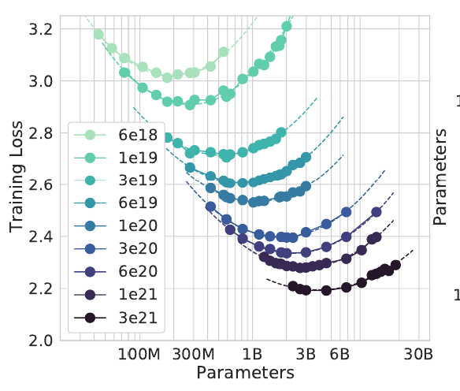
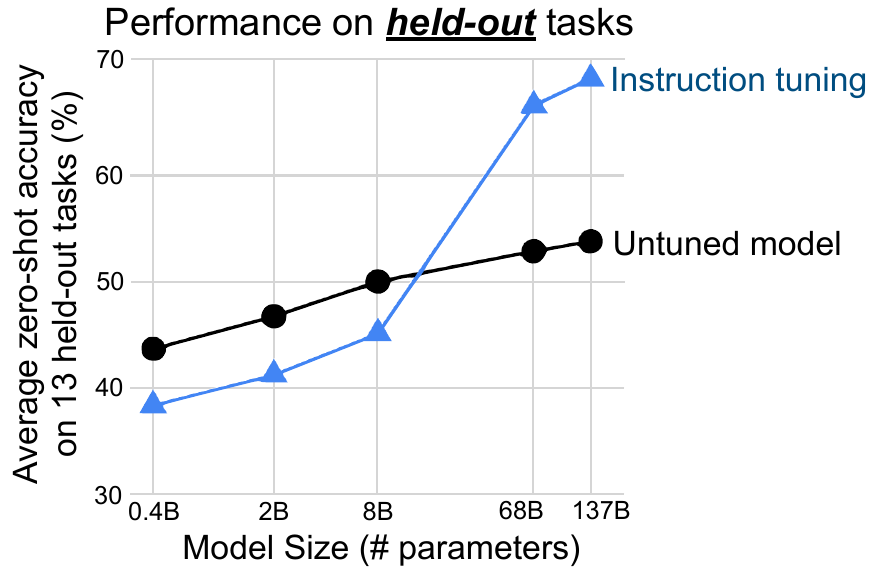
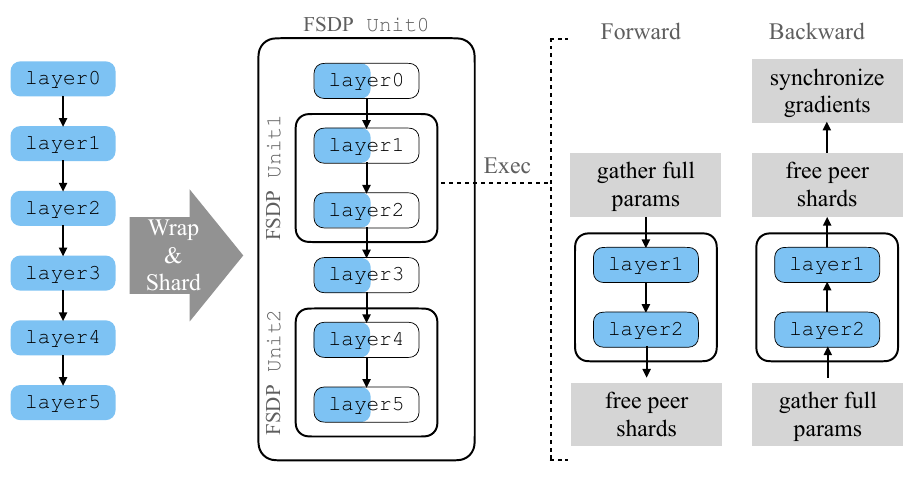

# Awesome LLM Papers  

# Papers

## Pre-Training

Choi, D., Xin, D., Dadkhahi, H., Gilmer, J., Garg, A., Firat, O., ... & Ghorbani, B. [**Order matters in the presence of dataset imbalance for multilingual learning**](https://proceedings.neurips.cc/paper_files/paper/2023/file/d346609ec2fefd3938c898a0dda4a480-Paper-Conference.pdf) NeurIPS (2023)

  
Notes

  - Often datasets that are used for training LLMs are imbalanced, i.e. one language is overrepresented (high-resource) while another is underrepresented (low-resource)
  - This paper investigates in which order one should use these high and low resource datasets to optimize the overall loss of the model
  - Their solution: pre-train on a high-resource task and fine-tune jointly on a mixture of high and low-resource tasks.
  - It is important to reset the learning rate schedule
and optimizer state when switching over to the joint fine-tuning phase
  - Why does it work better? "Pre-training utilizes positive transfer between tasks, and initializes the fine-tuning phase at a better starting point than random initialization"
  - A higher En→Ro sampling rate (e.g., 0.5) means that 50% of the training data the model sees at any given time are English-to-Romanian translation examples. If this rate is too high, it leads to overfitting, where the model memorizes the training data but fails to generalize to new, unseen examples.

## Post Pre-Training

Dherin, B., Munn, M., Mazzawi, H., Wunder, M., & Gonzalvo, J. [**Learning without training: The implicit dynamics of in-context learning**](https://arxiv.org/pdf/2507.16003) arXiv (2025)

  
Notes

  
  - They state that the attention block implicitly modifies the MLP layer weights according to context and therefore does in-context learning
  - The contextual information from the prompt is compressed into a single vector u=W ΔA(Y) and another vector v=A(C∖Y,x), and the new "effective" weights are created by adding their outer product to the original weights.
  - So the central claim is that the model's output with context is identical to its output without context if the MLP weights $W$ are modified by an update $\Delta W(C)$.
  - The update apparently looks like this (they have proof!): $$\Delta W(C) = \frac{(W \Delta A)A(x)^T}{\|A(x)\|^2}$$
  with $x$ the query token (the input we want a prediction for), $C$: The context (the examples provided in the prompt), $A(x)$ the output of the Attention layer for the query without context, $A(C, x)$, the output of the **Attention layer** for the query *with* context.
  - In experiments they provide pairs of numbers, for which the model needs to figure out the linear equation underlying these. They show that just adding their delta weight update (without providing context) to the MLP gives the same loss as doing inference with the full context and query. 
  - They state that this derivation is valid only for a single transformer block & w.r.t. the first generated token only. It does not capture the full mechanics of generation beyond that.

Hoffmann, J., Borgeaud, S., Mensch, A., Buchatskaya, E., Cai, T., Rutherford, E., ... & Sifre, L. [**Training compute-optimal large language models**](https://arxiv.org/pdf/2203.15556) arXiv (2022)

  
Notes

  
  - Simple but profound statement: for every doubling of model size the number of training tokens should also be doubled
  - They fix the number of floating point operations of the model (see legend, $6e18$ to $3e21$) and then vary the size of their model (y axis). For each model they plot the final loss reached (after reaching the fixed number of FLOPs) on the x-axis. Interestingly they see that there exists an optimal model given a fixed FLOP budget. FLOPs are "fixed" by stopping training early, so it can also be interpreted as the number of tokens the model sees.
  

Wei, J., Bosma, M., Zhao, V. Y., Guu, K., Yu, A. W., Lester, B., ... & Le, Q. V. [**Finetuned language models are zero-shot learners**](https://arxiv.org/abs/2109.01652) ICLR (2022)

  
Notes

- They basically show that instruction tuning a base model works
- For creating the datasets they use several different prompt styles in which they paste the datasets and give possible answers. The model is then fine-tuned on these datasets and then evaluated on hold out sets, which increases performance to baseline models
- Interestingly, they show that **small models performance is degraded when doing instruction tuning**, likely due to a lack of capacity for the additional task, while for larger models (>50B) it seems to work well. 
- Loss is just next-word prediction, so categorical cross entropy and examples look similar to something like this: 
Input "What's the capital of France? [EOS]"
Target: "Paris"
- The loss is only calculated on the part after the EOS token.

## Reasoning

Wang, Y., Wu, S., Zhang, Y., Yan, S., Liu, Z., Luo, J., & Fei, H. [**Multimodal chain-of-thought reasoning: A comprehensive survey**](https://arxiv.org/pdf/2503.12605) arXiv (2025)

  
Notes

  

## Hardware

 Tazi N., Mom F., Zhao H., Nguyen P., Mekkouri M., Werra L., Wolf T.  [**The Ultra-Scale Playbook: Training LLMs on GPU Clusters**](https://huggingface.co/spaces/nanotron/ultrascale-playbook) HF Blog (2025)

  
Notes

  - Ultimately training large models comes down to improving:
    - Memory usage
    - Compute efficiency
    - Communication overhead
  - Batch size (bs) is often reported as bst (batch size tokens), $bst = bs * seq$ with $seq$ the sequence length of the model
  - Most trainings are done using BF16 (brain (lol!) floating point), which has the same range up to $10^38$ while loosing a bit of precision compared to FP32, so something like $6.0234216424 * 10^{36}$ will become $6.023 * 10^{36}$
  - The memory requirements are mostly stable with respect to batch size except for the activations, which grow quickly with larger sequence lengths or batch sizes. To solve this we throw away some of the activations from the forward pass and recompute them in the backward pass. Optimal tradeoff between compute cost and memory seems to be when discarding all activations from the attention block and just storing the 
  - Parallel Strategy - Split:
    - Data parallelism (DP) – along the batch dimension
    - Tensor parallelism (TP) - along the hidden dimension
    - Sequence and context parallelism (SP/CP) - along the sequence dimension
    - Pipeline parallelism (PP) - along the model layers
    - Expert parallelism (EP) - along the model experts
  - Added Zero:
    - ZeRO-1 – sharding optimizer states among the DP replicas
    - ZeRO-2 – sharding optimizer states and gradients among the DP replicas
    - ZeRO-3 – sharding optimizer states, gradients, and parameters among the DP replicas

Zhao, Y., Gu, A., Varma, R., Luo, L., Huang, C. C., Xu, M., ... & Li, S. [**Pytorch fsdp: experiences on scaling fully sharded data parallel**](https://arxiv.org/pdf/2304.11277) arXiv (2023)

  
Notes

  - Presents a new framework for training large (>30B) parameter models across several GPUs
  - Pipeline Parallelism (Vertical Split): Partitions a model instance into stages, with each stage being processed on one instance. For example first layer being processed by first GPU, second layer by second GPU etc...
  - Tensor parallelism (Horizontal Split): Splits up the model parameters (e.g. within one layer, thats why its horizontal) and processes these across several GPUs. Communicates at layer boundaries (e.g. going from layer 1 to layer 2)
  - Zero-redundancy Parallelism: Also splits up the parameters but communicates parameters on-demand. So I think the difference is that Zero communicates parameters, while TP communicates activations. 
  - Their technique called FSDP is very similar to Zero but adapted to the Pytorch framework.  
  - **FSDP communicates parameters before computation, while TP communicates activations after partial computation**.
  - There are different sharding strategies, which they parametrize using the sharding factor F:
    - if F is 1, the model is fully replicated on each device
    - if F is W (the number of available GPUs aka world size) then the model is fully sharded. This has the lowest memory footprint with the highest communication overhead.
    - If F is between 1 and W, they call it hybrid sharding
  - Communication Strategies:
    - Overlapping:
      - GPU can fetch the parameters for the next layer while still computing the current one, so it runs on a different process
    - Backward Pre-fetching: 
      - To avoid a communication bottleneck during the backward pass, they issue the request for the next layer's parameters before it has finished calculating the current layer.
    - Forward Pre-fetching: 
      - When the model is static, the execution order from the previous training iteration can be used to fetch (another layers) parameters even before the forward pass for that layer begins.

